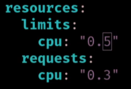
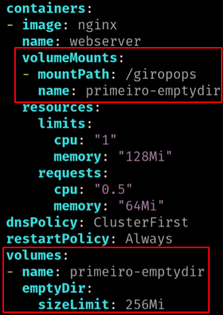

## Criando um pod
kubectl run nomepod --image=nginx --port=80
## Exibindo valores do pod
kubectl get pods -o wide
## Acessar um POD sem ter o nginx rodando
kubectl attach nomedopod -c nomepod -ti
## Acessar um POD com o nginx rodando
kubectl exec -ti nomedopod -- bash
## Criar um pod a partir de um manifesto pod.yaml
kubectl create -f pod.yaml = cria um novo pod
kubectl apply -f pod.yaml = cria ou atualiza o pod existente
## Verificar a saude dos pods
kubectl describe pods
## Verificar logs do pod
kubectl logs nomepod
## Verficar logs do container dentro do pod
kubectl logs nomepod -c nomedocontainerdentrodopod
## Exibe nome dos container dentro do POD
kubectl get pods -o custom-columns=POD:.metadata.name,CONTAINERS:.spec.containers[*].name

## LIMITANDO CONSUMO DE RECURSOS DE CPU E MEMORIA
Requests = Limite inicial de CPU Usado para inciar o pod
Limits = Limite maximo de CPU usado pelo POD durante o seu uso

Acessar o pod para verificar as configs
kubectl exec -ti nomedopod -- bash
Verificar o consumo de recursos dentro do pod
apt-get install -y procps
top
ps -ef
# Verificar consumo de memoria
free -m
# Verificar consumo de CPU
mpstat
## Stress no pod
sudo apt update
sudo apt install stress

stress --vm-bytes 64M = comando para stress de memoria
stress --cpu 2 = comando para stress de CPU

## CONFIGURANDO VOLUMES
Volumes = Espaco de armazenamento que o pod ira utilizar para salvar os dados
Tipos de Volumes:
emptyDir = Volume temporario que sera apagado quando o pod for deletado
hostPath = Volume que utiliza o disco do Node onde o pod esta rodando
persistentVolumeClaim = Volume persistente que utiliza um armazenamento externo ao cluster

Criar um pod com volume emptyDir
kubectl apply -f pod-volume.yaml
-- CONFIGS DO VOLUME NO YAML

Verificar se o pod esta rodando
kubectl get pods
Acessar o pod
kubectl exec -ti nomepod -- bash
Dentro do pod criar um arquivo no volume
cd /usr/share/nginx/html
echo "Teste de Volume" > index.html
mount = exibe os pontos de montagem dentro do pod
Sair do pod e deletar o pod
exit
kubectl delete pod nomepod